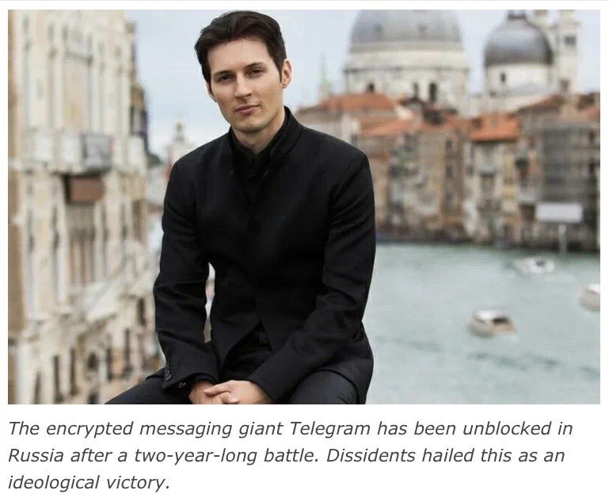
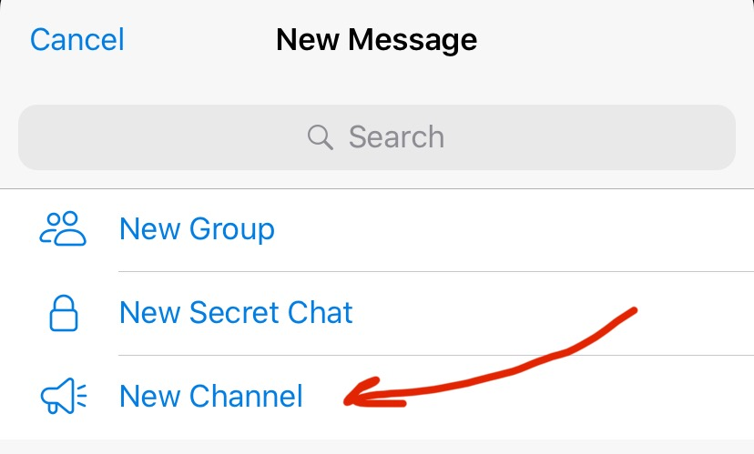

从隐私保护、用户体验角度而言，可以取代微信的app排在最前面的有telegram和line，后者笔者了解有限，也非常期待有人写一下line的使用攻略科普。我使用telegram已经近一年，亲测好用。

前几篇文章已经从[新手上路、群主操作](../telegram_novice_group/)、[电报频道（类似于微信公号）](../telegram_channel/)、[文章编辑器](../telegraph_intro/)做了介绍，这篇再详细说一下如何用telegram操作华人关心的微信朋友圈功能。

<!--more-->

## 一、如何用电报发朋友圈？

可以用开设个人channel（频道）的方式，行使类似于微信朋友圈的功能。方法是：

1. chats界面下选择右上角图标点击进入

2. 选择New channel

3. 选择create channel，之后取名、挑选照片、写说明介绍


4. 选择channel类型，public的可以自己给link取名，private的系统会自动生成一个link


5.从你的telegram通讯录里面选择好友（subscribers），这样他们就成为你“朋友圈”的粉丝。可以看到你的更新。

6. 将ID：LikeComBot （这是个bot, 机器人ID）加为好友并加到你的channel，且设置为admin，这样频道文章就自动带加点赞和评论的功能了。


缺点是这个bot不是特别稳定，尤其在在网速环境差的时候有可能不会给文章下面自动带上点赞和评论。办法是重发一下，多试几次。退而求其次，如果只用comment bot，稳定性好很多。

## 二、管理你的telegram群、频道、朋友聊天和“朋友圈”

可以把自己telegram各种群、个人和频道（朋友圈）管理一下，以方便一次性浏览朋友们的朋友圈（频道）。

操作步骤：

1. 从settings界面进入，选择chat folders


2. 选择create new folder


3. 输入folder名，比如叫“朋友圈”，然后选择添加你的好友的频道（included chats下点击+ add chats)


4. 之后勾选你要整理到一起的朋友的频道，点击done，就构建好属于你的朋友圈了。


5.这时候回到Folders界面，选择右上处的Edit，可以给你的folders排序。


上下推移右边红框里的排序icon，将决定你的folders的位置。


最后，在Chats界面下，最上方从左到右就会按照你给folders的排序依次出现你的folder。


总之，没有一款墙外社交媒体聊天App工具不是以方便沟通为目标建立的，多探索各种功能键，您很快就会得心应手了。这里只是抛砖引玉，更多使用心得，在聪明的你的掌握了解之中会被发掘出来～

## 附：微信禁封风波的背后

简单回顾一下前因后果，比较近的一个起始线是2019年10月，共和党参议员Cotton和民主党参议院领袖Schumer发起两党联盟的行动，致信参议院情报委员会，要求调查抖音和其他中国应用程序(app)。虽然当时没有直接点名微信，但是微信显然是“其他中国拥有的app”中首当其冲的。



他们的理由总结一下主要是：

1、海外版抖音所属的字节跳动公司虽然自称不在中国运行且数据存储在美国，但是该公司依然被要求需要遵守中国的法律。

2、由于中国法律有要求公司支持和配合共产党（CCP）的规定，引发对中共情报机构及其人员利用这些科技平台对美国进行系统和常规的间谍渗透活动的担忧。



更多细节大家可以直接去看原文：https://www.cotton.senate.gov/?p=press_release&id=1239

可见，这种警惕和呼声并非一个党单方面的考量，而是来自两党（重量级人物）的共识。

比如这篇《纽约时报》的评论文章里，也点名微信被中方情报力量利用，监视和接近海外华人。这反映了左派/民主党对微信的置疑和不信任程度。



https://www.nytimes.com/2020/08/07/technology/trump-tiktok-wechat.html

陌上美国Telegram channel，欢迎订阅:

https://t.me/MoshangUS