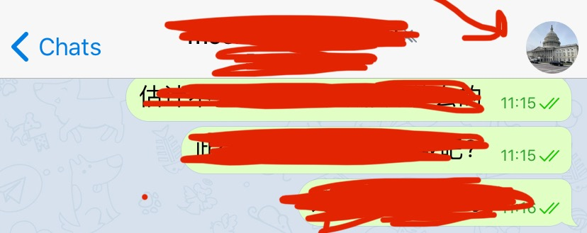

川普政府考虑禁微信的消息传出之后，在美华人出现一波走出微信的新动向。

如果是选择聊天工具，基本是在Telegram、Line、WhatsApp几个app之间做选择。

Line据说是日本人开发的、2011年左右开始的App，台湾人使用很多。它跟微信功能类似程度高，缺点是同一个群任何人都可以踢人，这种设置对群成员素质要求比较高。

WhatsApp界面体验比较像手机短讯，缺乏类似于微信公号的功能。而且直接显示用户手机号码。

Telegram相对来说是集微信和上述几款App的优点，最适合从微信过渡过来的一款App。

<!--more-->

先说缺点（有的属于没有根据的一些怀疑），安全上因为其开发者是俄罗斯人，引发一些人的相关猜疑。但是俄罗斯人不等于个个就是普京/专制支持者，至少目前没有听说Telegram在隐私泄漏上有什么丑闻。根据一些报道，他们的团队人员全球飘，近期据说在沙特，但是他们拒绝向任何政府提供服务器位置和用户数据等信息。如果你只是需要一个不被封群、删帖、敏感词困扰的聊天信息交流工具，Telegram这些方面比华人以前用的微信强多了。当然如果您有更崇高的解放世界的追求，笔者就不确定Telegram是否有那么高规格的安全系数了。

下面，介绍一下telegram的一些入门操作。

首先下载了Telegram App之后，从右下角settings进入，修改privacy and security设置。


你需要将自己的手机号码隐藏、选择为不可见，其次将自己在线时间(last see & online)可以考虑改成隐蔽(nobody)，其他就根据自己的需要随意设置了。


把这些修改以后，你就可以开始建群、加群、开Channel（类似于微信公号）等各种操作。

先说建群的操作，在chats界面下，选择右上角的这个红圈内的看着像“纸加笔”的标示，点击它：


进入之后，第一个选择就是New Group，点击进去。按提示操作就可以开始建群了。


只需要两个人就可以建初始群组，这样就会有一个群的link。然后把link发给其他朋友，让他们用手机或者电脑浏览器打开这个link，就可以方便地进入群组。Telegram群的上线是20万人，跟微信群500人上限天壤之别。

每个群都是有自己独特的地址的(Link)，可以从一个群的右上角（通常是一个圆形的群的logo/图片，即下图红箭头所指）点击进去。

再选择右上的Edit（红箭头所指）：


进入新的界面后，中间位置有个Group Type的选择，点击它，就可以看到一个群的link地址了。不同于微信群，telegram群不需要发二维码或者靠一个个地手工拉人，而只需要把群组的link发给别人，让对方将link贴到手机/电脑浏览器，点击Join就可以方便地进入。


在group type的下方，是Chat history for new members，可以选择visible，这样后来加群的新成员也可以看到群里之前的聊天记录。

同样上图这个界面的下方，有permissions和administrators两个功能，后者是用来添加管理员的，前者是个很强大的功能。点击进入的话，在Permissions界面下有几个很实用的操作：  


第一个红箭头所指是slow mode，就是设定一个群的群内成员发言的时间间隔，从0秒到1小时不等。

第二个箭头所指，是踢人操作，将要踢的ID加进removed users黑名单，此ID就没有机会再进群了。相当于一群给一个ID判了“死刑”。

第三个箭头所指，Add exception，可以将要针对性使用Slow mode的ID添加进去，这样这些用户就需要间隔不同时间才能发言。

如果要发长文，可以使用 telegra.ph 进行编辑。这个界面相当美观，生成的文章可以在telegram、微信、line、网页等各种界面上打开阅读。

搜索Telegram web，则可以很方便地进入网页版telegram，跟手机版一样好用。

更多了解可以看这个介绍：

https://telegram.org/faq

请读者朋友们收藏【陌上美国】的联系方式（有的仅海外可用）：

邮件: moshangusa@gmx.us

Telegram频道: https://t.me/MoshangUS

Telegram群（下载app改个人信息；拷贝群地址用浏览器打开，微信打开无效；点击join): https://t.me/joinchat/OY6TCk-W0yNMWNhNlGHsKA