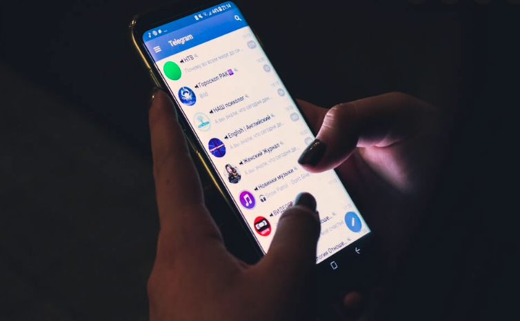

【摘要】本文科普电报的几个法宝性质的功能：

1. 如何建立电报的个人朋友圈，并给帖子配上留言功能；
2. 如何分类你的讨论群，和与各朋友的联系；
3. 如何在电报查找信息及清理电报内存；
4. 其他使用小窍门，比如随时可以修改或删除你的发言

<!--more-->

开始用电报（Telegram）是2019年，当时参与为美国有更健康的移民法律系统、为华人争取公平拿绿卡机会的行动（关于这个反H.R.1044/S.386的草根运动，还有一些不吐不快的后续，欢迎拉到文末了解），其他族裔的盟友都在电报上建了群，为了方便联系于是我们也加入。

一开始我也有要学一款新APP的天然心理障碍，不过不到一周就发现值得花这个时间。电报能在3年内用户翻近2倍达到7亿活跃用户，确实是因为实力说话，一款讲究自由的最佳社区工具。本文科普电报的一些使用技巧，很容易学，抛砖引玉。Telegram上手以后，你一定会越来越喜欢，再看那些封杀禁言的APP，感觉就像缠足刑法一样。

对于普通电报用户，最重要的就是花三分钟了解基本上手的这几个操作：

0. 修改个人设置，保护好隐私

首先最重要的，下载了Telegram的App（应用程序）之后，就是修改个人设置并且不要回复电报上的陌生人打招呼的信息，直接block。

这里对电报陌生ID私聊骚扰多说几句，这是电报用到目前唯一明显不足之处。但是可以想像一下，这些带任务的来找你私聊，只要不回答直接拉黑，问题就消除了；而平常大家用微信，都是暗中就被记录数据和个人隐私——否则那些定向被半封的个人用户怎么来的？那些无形的手的操作才更可怕。

言归正传，以苹果手机界面为例，从主页的右下角settings（图中红圈地方）进入，修改个人安全设置(privacy and security)。



将自己的手机号码隐藏、选择为不可见，其次将自己在线时间(last see & online)可以考虑改成隐蔽(nobody)，其他就根据自己的需要随意设置了。


把这些修改以后，你就可以开始建自己的朋友圈、群、加群、开Channel（类似于微信公号）等各种操作。

## 1. 电报可以像微信一样，个人账户拥有朋友圈吗？

**可以！**

首先开一个自己的channel（频道），比如我自己的 https://t.me/moonpolar 可以取名叫“某某某的朋友圈”，比如我的就叫“大自然的朋友圈”

操作步骤分解：

从电报主页进入chats（聊天）界面，之后选择右上角的这个红圈内的看着像“纸加笔”的标示，点击它：


进入之后，第一个选择就是新群(New Group)，第三个选择是New Channel，点击进去。按提示操作就可以开始建Channel（频道，即可以做你的朋友圈）了。建群跟建频道类似，下面以建群为例说明怎么操作，知道一个就两个都通了。


开群方法是，从上面的界面选择第一个选项，就是新群(New Group)；

只需要钩上两个ID就可以启动一个初始的新群组，这样就会有一个群的link。然后把link发给其他朋友，让他们用手机或者电脑浏览器打开这个link，就可以方便地进入群组。Telegram群的上限是20万人，跟微信群500人上限天壤之别。

至于怎么对频道和群进行管理？你可以看一下这个文章👉[电报新手入门攻略](../telegram_for_novice/)

建好了你的朋友圈（即Channel/频道），也开个你自己的群之后（比如我的是 https://t.me/+PcsA_5K_ruUyZTMx）

把你的群设置成你频道（Channel，即朋友圈）的讨论群，这样你的好友就能对你朋友圈的更新留言评论了。

操作步骤：
-自己建好确立做朋友圈的channel 后，右上角图标点击进去


-进入后选择discuss（图中红圈）按照提示操作就行了。会让你选择一个群（就选择你刚刚建的群），你朋友圈的评论留言都会出现到那个群。没有订阅那个群的，只要加了你的朋友圈（即你用来做朋友圈的频道）也一样可以留言。


https://twitter.com/MoshangUsa/status/1577749907330322434?s=20&t=y08PfZgkIm9TzzMM_f9GiQ

## 2. 分类电报的群和频道，以方便看电报朋友圈

这个功能极为实用，手机界面为例：

- 电报主页中选择右下的settings，进入，之后选chat folders


- 进入后点下面create new folder


- 点要编辑folder选点击add chats添加频道或群。你可以建一个叫“朋友圈”的文件夹，然后把好友的朋友圈（即他们的个人频道）都加到这同一folder，就能一次性地看所有好友的朋友圈了。


- folder名称都会显示在电报chat界面上方（红箭头），可以方便选择进入。


## 3. 如何在电报查找信息及清理电报内存

强大的归类和历史记录查找工具-如何用好电报的 # 标签？ 

大家注意过类似于下图中蓝箭头指向的这种井字键带的小标题了`/tag`词条吗，这些是可以直接点击的，之后就进入后面图的界面。


下图中数字1所在处，显示该小标题；数字2处是用来滑动上下搜索用的；数字3处是显示带有这种小标签的帖子总计有多少条；数字4指向的是这个搜索功能可以同时查某一个频道/群，也可以查你有的所有群/频道中，带有这个小标签的所有帖子。


群聊记录多了之后，需要了解一下电报如何清内存，省得占空间 

- 以手机界面为例，从右下角选择 settings
  
- 进入后选择 data and storage

- 进来后，根据需要选择保存时间，最下面清除cache最管用，刚刚清掉4G的cache。被清理了也还是都给存在数据云上，不会丢失的。


## 4. 其他使用小窍门
- 4-1. 分别从左侧或者右侧末端，左右滑动聊天对话框，可以出现pin（置顶）、删除群聊、取消提醒等功能
- 4-2. 如果直接分享微信文章link，据说是可能因此被定位的。请转换成电报格式再发电报。方法就是把微信link发消息给 @CorsaBot 会自动生成电报格式，再分享电报群。
- 4-3. 修改或者删除你的发言：你在电报的任何发言（文字、语音、图片等），都是可以随时删除或者修改的，而微信只能在2分钟内删除修改。方法就是长按你的发言，跳出对话框，选择edit（编辑）或者delete（删除）。
- 4-4. 引用别人或自己的发言，针对特定发言回复：如果是手机，就向左滑动你要回复的那条发言，自动就被引用了。或者你可以长按要回复的发言，这样跳出对话框，选择第一个选项，即回复（reply）功能。被回复的发言，点击它则可以自动跳到发言的全文内容。非常方便考古。
- 4-5. 👉 [让电报频道插上翅膀的编辑文章神器telegraph](../telegraph_intro/)

如果想了解更多电报使用技巧，欢迎来我的朋友圈提问 https://t.me/moonpolar 

陌上通过2-3年的不懈努力，已经有约20%以上的墙外读者（美国、加拿大、欧洲等地），累计大概1万多人开始用电报。其实联系家人也可以用Signal，或者苹果手机FaceTime。而陌上在热心读者们的帮助下，志愿者们也一起打造了电报教育、旅游、经济、美食等各种实用群，为方便大家脱离言论控制的平台，自由分享生活信息提供选择。至少我们在自由世界，摄取时政新闻不能再主要靠一款美国之外的搞封杀禁言管控的APP，尤其其言论控制在变本加厉。这就像以为只是吃个止疼片，其实很多毒害不知不觉植入，造成毒品上瘾而不自知。

时政信息分享兼读者主群👉 https://t.me/+KY6EeBC-aXYzNmMx

教育生活群👉 https://t.me/+V5Eq3FRCHsWWj7pR

经济股票群👉 https://t.me/+QjssrdJyFOI0N2Vh

美食快手群👉 https://t.me/+0UBaTQj-Gx0wYjYx

运动旅游群👉 https://t.me/SportsTravel

家居杂务DIY群👉 https://t.me/+MIVZFTnPBEkwNWJh

----------

如果您都读到这里了，我可以说说当年反S386之战的事后信息了。反S386这事，陌上和咔咔（cacaa）做得问心无愧，干干净净。那种常年造谣的人，比如滤网/绿网那种（它有很多马甲，电报上有一个叫Kafka Tensor, 后改名Tensor Torch，最近改成用BG上电报，bbs上叫pharmacy，微信上叫绿网，等等），这人从2020年前后开始，就一直恶毒攻击辱骂陌上、咔咔没有歇气过，甚至还诅咒我的家人，迟早多行不义必自毙。

2020年左右开始，滤网（Tensor Torch）等人弄了一个专门钓鱼留学生和H1B的电报群，给外宣干活带风向，与被外宣买了/渗透的一亩三分田长期互动合作，相互打广告拉人。那个电报群现在依然活跃，达6000多人。我以后会写文说这个人数的造假程度有多高。那个群从开始到现在，打着给留学生、H1B分享办绿卡经验的牌子，实质是刷两种洗脑：

一是把我们这些社区义工辛苦帮助华人学生移民战斗2年的历史完全抹黑成反的，没底线造谣陌上和咔咔“恨华人”。不断循环这样的明显谣言，洗脑那个群里的人，到现在都是如此。陌上的立场是反间谍渗透，也反对开放边境进来海量非法移民，这些都是支持合法移民的核心必须。这些五毛人渣自然是成天要颠倒黑白。

另外，他们洗脑群里H1B、学生支持这个建制派、极左当道的民主党，否则就给他们很多道德枷锁攻击审判，比如把不支持民主党说成是“反移民、上车关门”。他们还搞了H1B工作群、移民群。在这种表面口号下，其实是不断给来美国时间不足够长的这批人，灌输受害者心态，完全是大外宣社区渗透活动的一个重要一支。

外宣的工作是无孔不入的，必须不能留任何独立的、不受五毛支配的平台，有了就一定要整死，让这种无法生存发展，尤其不能对在美国的华人产生实质的影响力。所以无论是否谈罩国的事，不加入他们，就等着被系统性摧毁。

不过他们要毁掉陌上是徒劳，陌上已经度过最艰难的阶段，浴火重生。以后美国的司法会跟上，帮助被打压的人反击。BigTech作恶会有法律来追击，至于滤网这种垃圾，坏事干尽，它还从外宣拿钱在mitbbs（封了以后去新的平台）作妖。随着国际局势的变化，这种祸害美国、针对留学生H1B搞信息战的变态势力，迟早会到被废掉绿卡驱逐出境的一天。正义或许会迟到，但不会缺席。一时的猖狂不会永远持续，美国的法律早晚完善。就像一些偷技术的spies，在十多年几十年之后，虽然法律晚到了，但逃不了成为落网之鱼的结局。

有的留学生、H1B有意无意花很多时间在滤网那种垃圾搞的电报洗脑群，和一亩三分田这种典型外宣味的平台，更别说有的还上MITBBS那种shithole，净吸收一些戾气和极端思维。对于自己在美国发展毫无益处，不知不觉之间，就长期做了外宣的韭菜。当年S386就是卡马拉·哈瑞斯提出来的，结果很多反对这个法案的留学生、H1B，后来都跟着外宣信息统统去支持民主党。被一些炒作“中国病毒”的洗脑宣传吓唬，却不睁眼看看，现在频频爆发仇恨亚裔犯罪的，伤害亚裔老人女性的，绝大多数都是来自民主党掌权的蓝州蓝区。以为自己是硕士、PhD，或者高级白领就能躲开治安恶化吗？就这几个月内就有纽约市被推下地铁死掉的第一代移民女高管、被跟踪到家里被刀砍死的30来岁的风华正茂高学历女性。不到3个月，芝加哥大学前后2名华人才俊学生被抢加打死，也是发生在民主党执政近一个世纪的这个城市。

五毛的社区渗透，导致以怨报德、劣币淘汰良币现象。 这样的结果让咔咔、陌上这种独立的草根组织/平台，付出极大代价，非常心寒。不求回报，但是没有人要高尚到出了那么多力，还要被反咬一口常年被抹黑“仇恨移民”的大帽子。 我们都是公民至少也有绿卡，根本没有奋斗绿卡的利益需要。当时是为了社区为了华人当然也是为了美国有健康的移民制度，顶着ICC那种外敌。结果战打完了，却还有外宣五毛来摘桃子加这么多年的持续造谣抹黑。这是完全想不到的。

毕竟大家都是草根参政，一朝被蛇咬十年怕井绳。以后，再来找我们反Sx86，让人怎么想？无论当时如何倾力付出，也没有得到基本的尊重和感谢，反而是被一些当时帮助过的人成了仇恨的对象，是非不分。现在留学生H1B大多也是被外宣的洗脑信息轰炸得，基本都选择回国了。那种集体焦虑绿卡的情况，基本也成了过去式。所以我也看清了，陌上反对极左祸害美国，反对民主党破坏美国根基走向一党独大，就是帮助华人留学生和H1B。反Sx86这种事，真是被那些冷漠无情，弄得极为寒心。一个原则，只有清醒的分辨力好的人群，才值得帮助。否则费力做义工倒养了仇人，被反咬。

美国经济在拜登上台之后被搞得一塌糊涂，IT大厂纷纷裁员。当年那些反S386，到了大选前却被外宣忽悠着去支持民主党——连推出S386的哈瑞斯组队的这种民主党都可以支持的，你们要的身份，在经济萧条时候，更难保证。这届把identity放到能力之上的政府班子，交通部长不懂物流、国土安全局管不住边境、Fed一再错判经济、而搞经济的恨银行、副总统这种成天喊equity要加剧肤色分裂美国的极左路线、......，这个list还有更多更多。整个内阁各种玩政治比玩本职工作在行的官僚主义当道，这要什么样的运气，才可能保证民生不崩盘？民生差了，那种为了早几周拿绿卡而缺乏长远眼光的，现在，恐怕被扫出美国的，最先就轮到这种人。真是自己给自己挖坑。

而且IT和其他行业的裁员刚刚开始，寒冬降至。但愿被滤网（Kafka Tensor/Tensor Torch/BG）这类人忽悠的学生、H1B早日醒过来。在美国培养毋以善小而不为的习惯，如果每个人都选择明哲保身不反抗，那么就会被渗透势力各个击破；相反，如果人人用行动抵抗打压，那种要渗透华人社区的力量就无技可施。他们也根本没有财力、人力去对付千千万万不受洗脑控制的独立的灵魂。
