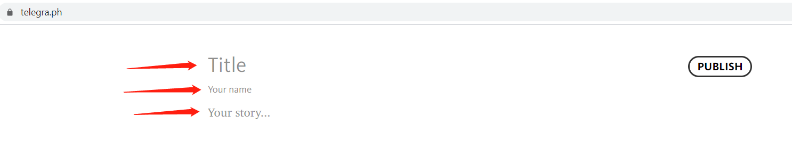
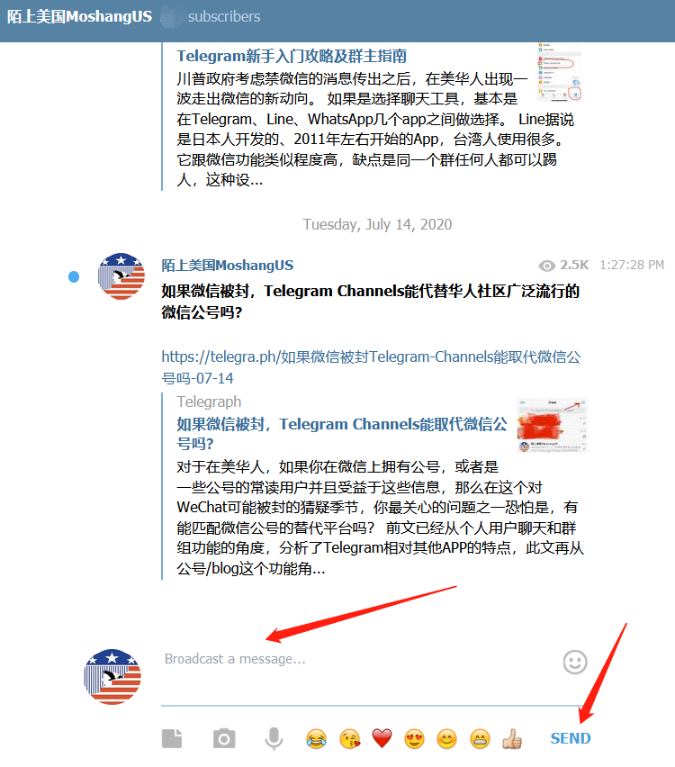
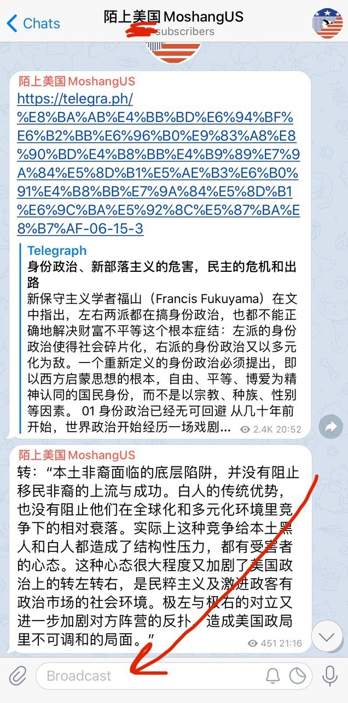

如何编辑长文发表在电报频道上？

前文提到了用长文编辑生成网站: https://telegra.ph/ 可以写长文并发表在频道上，让频道有blog/微信公号的效果，这里就具体地介绍一下它的一些基本应用操作。

<!--more-->

这个网站跟medium、matters之类的平台有很多类似的地方，在电脑或者手机浏览器里输入其网址，就进入清洁的编辑界面，如下图所示：

https://telegra.ph/界面

从第一个红箭头所指的地方输入文章的标题，第二行输入作者名字，第三行开始进入正文。

在正文部分，每次回车新起一行后，鼠标左侧都会出现这样的提示：



点击相机标志就可以插入图片；点击上图第一第二个红箭头所指的黑色左右符号，就会跳转到新的提示，让作者插入视频、推特等各种连接：


一篇文章编辑完毕之后，点击右上方的PUBLISH按钮（下图红箭头所指），就可以生成文章，保留其网址，还可以反复回来编辑修改文章(Edit)。


以[《如果微信被封，Telegram Channels能取代微信公号吗？》](https://telegra.ph/%E5%A6%82%E6%9E%9C%E5%BE%AE%E4%BF%A1%E8%A2%AB%E5%B0%81Telegram-Channels%E8%83%BD%E5%8F%96%E4%BB%A3%E5%BE%AE%E4%BF%A1%E5%85%AC%E5%8F%B7%E5%90%97-07-14)这篇文章为例，发表以后，保留网址（左边箭头所指），可以随时回到文章，用右上角的Edit功能修改，改完之后再点击发表即可。


除了以上的小窍门，还可以给文字插入链接、改粗体、调整字的大小、变成引用等。方法是，用鼠标任意选择一段文字，被选部分出现灰色阴影，同时其上端跳出选项。这个时候可以根据自己的需要选择不同的功能，比如，下图箭头所指的加入链接，这个功能很实用。


一旦完成了文章的编辑，发表以后生成一个网络地址，拷贝下来，比如这样的：

https://telegra.ph/%E5%A6%82%E6%9E%9C%E5%BE%AE%E4%BF%A1%E8%A2%AB%E5%B0%81Telegram-Channels%E8%83%BD%E5%8F%96%E4%BB%A3%E5%BE%AE%E4%BF%A1%E5%85%AC%E5%8F%B7%E5%90%97-07-14

将文章的这个地址和对文章的导读介绍贴到电报频道的broadcast的地方（下图中红色箭头所指），点击“Send(发送)”，就完成一条新的频道更文推送了。

<figure>

</figure>

无需等待，对比一下发个公号文章要受到的拖延和各种过审被虐，一切便捷得“不真实”。

而由https://telegra.ph/ 编辑发布的文章，通过分享链接是可以发到各种不同平台的，包括Line、Whatsapp、推特、facebook、微信等等，就像分享任何新闻/blog/公号文一样容易。

如何订阅电报频道？

频道文章跟一般群聊信息很容易混淆，区别在于右下角，频道文章有个view的点击数，而一般发言没有点击计数。见下图所示，第一个箭头所在的信息是频道推文，第二个箭头所在的则是一条一般的聊天信息。


分辨了这个之后，如果要订阅一个频道，读者可以点击频道文章上端带的频道名字（下图红箭头所指），就会进入频道的界面：


选择下方的join（红箭头所指），就成功订阅了一个新的频道了。



本文再加上前面这两篇攻略，读完这三篇，熟练这些操作之后，无论是与朋友聊天还写文，你应该已经对墙外工具乐不思蜀啦。

[Telegram新手入门攻略及群主指南](../telegram_novice_group/)

[如果微信被封，Telegram Channels能取代微信公号吗？](../telegram_channel/)

请读者朋友们收藏【陌上美国】的联系方式（有的仅海外可用）：

邮件: moshangusa@gmx.us

Telegram频道: https://t.me/MoshangUS

Telegram群（下载app改个人信息；拷贝群地址用浏览器打开，微信打开无效；点击join): https://t.me/joinchat/OY6TCk-W0yNMWNhNlGHsKA
