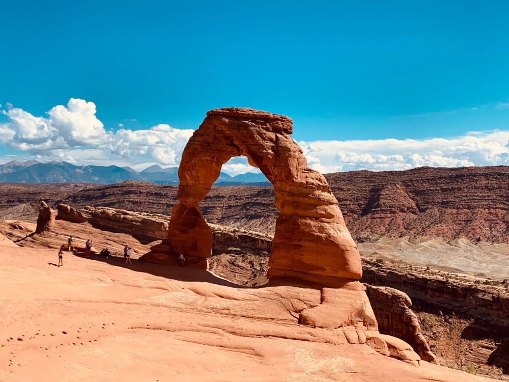

2022年，是横跨千山万水，走遍美国东西两岸的一年；也是为诸多要事做了很多铺垫工作的一年。2023年，将是充满机会、转折和进入丰收的一年。

<!--more-->


（Rumble链接：
https://rumble.com/v23hajg-from-the-pacific-ocean-to-the-atlantic-ocean-travels-from-coast-to-coast-in.html
）

看到美国大地各处的旖旎风光、山河多娇，与各种亲切友善的人群交流沟通，无比感恩自己和后代能生活在这片富饶美丽的土地，享受前人奋斗出来的自由和文明。同时，也到了我们自己奉献和传承美国精神的时刻，一起携手，保持乐观，积极努力吧。

其中黄石和大提顿国家公园部分，之前也做过一期视频。感兴趣的朋友请欣赏秋冬交接之际，黄石和大提顿国家摄人心魄的风光。


（视频和图片来自本人、朋友还有群友的友情提供。）

两大国家公园进入初冬将至的季节，白皑皑的大雪，让壮丽的大自然奇景更加披上美轮美奂的光芒；游客减少带来的空旷和寂静无声，也为历历在目的绝色风光添加了神秘色彩。冬天也是黄石和大提顿国家公园常封路的季节，不过能增加看到狼群的机会。我们在即将陷入黑漆漆的夜晚之前见到了小灰狼；群友则分享了1月初大雪压青松场景下，雪地里头狼的风姿。

当年第一次游历黄石的时候，自己更多还是都市居民的个性；经过多年美国生活的熏陶，已经越来越能感受自然界的呼吸，而今带上了更多郊野村民的敏感，可以捕捉到许多不曾能打动自己的细节。

热爱大自然不需要通过说教，当亲历过这些无法用语言描绘表达的好山好水、动物遍地的震撼风景之后，自然会感恩造物主的鬼斧神工。有机会就多带家人和孩子出门看看。别辜负了这大好河山。

最后祝各位朋友们，2023新年快乐！

运动旅游群 https://t.me/SportsTravel

推特 https://twitter.com/MoshangUsa