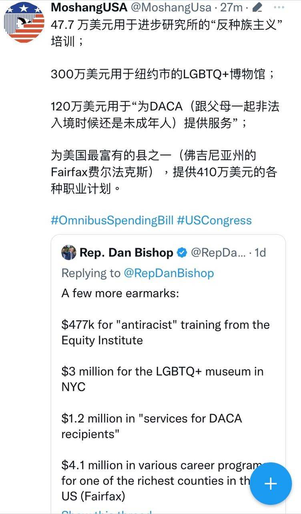
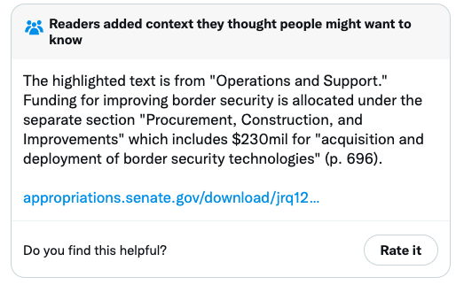

众议院最重要职能之一就是管国家花钱的事，本届民主党把持的众议院总算到头了，明年一月份就可以迎来共和党主导的众议院了。

就是最后一个多礼拜，民主党还是抓着最后一口气整出不少事情，其中包括试图让国会水过造价1.7万亿的年度财政法案。该法案全文厚达4155页，根本只有4个议员提前看过，却要其他400多众议员在1、2天内“读完”，并且投票通过。相当于需要连续16个小时每分钟不间断地阅读4页以上。一场闹剧，自然各种抱怨此起彼伏。
<!--more--> 

这种推进节奏，自然也让人怀疑是想带球私货突破吗？没时间读全文的，看这两个最有代表性的剧透就能大概知道整个法案的造型了：

不过，北卡的众议员Dan Bishop突然一声吼，我的团队把这4000多页的法案给啃完了，下面是要点总结！

那么，就跟着看看咱们交的税将会被怎么花掉吧。

砍掉了海关和边境保护局（[Customs and Border Protection](https://www.cbp.gov/)，CBP）的拨款。没有这种手印怎么能叫民主党染指的财政预算？



不过有读者补充了内容，指出在另一项条例下，包含了2.3亿给边防科技的拨款。

但是这多吗？看看下一条就一目了然，给约旦、黎巴嫩、埃及、突尼斯和阿曼的边境安全支援都比给自己国家的高近乎一倍，4.1亿。

此外，当然少不了给国际组织付会员费，比如联合国，累计就超过14亿。


光是“三文鱼”就在法案中出现48次，保护这一个动物就给了6500万。🤔不给气候比大展身手的机会，怎么显示民主党爱科学（教）的本色。



给建保护🐝蜜蜂的高速公路拨款300万，同一条款中还有500万，又是给三文鱼业。

其他鱼🐟也不会失宠的，给了6570万补贴国际渔业。谁让拜登说过“人类跟鱼可以和平相处”。


至少5.75亿将投放给所谓的人口增长威胁到生物多样性的地区，打着的名号却是“家庭计划”。

Bishop议员评论，“马尔萨斯主义（即人口控制计划）是一种可怕的反人类的意识形态，在任何联邦计划中都不应出现。”

下面一项是花纳税人的钱，给沼泽大颚级别的政客献媚。累计6500万美元，花在给Leahy参议员搞两个项目，以及将一个联邦建筑以南希·佩洛西（Nancy Pelosi）命名。

难怪极左忙着推倒杰斐逊等建国先贤的雕像，不破不立，否则南希这类人怎么找到位置让名字排上“永垂不朽”？



这类献媚工程还多了去了，一串清单中，惊现花360万美元给一条小径命名为“米歇尔·奥巴马路”这档子事。

沼泽大颚的胃口还包括：

47.7 万美元用于进步研究所的“反种族主义”培训；

300万美元用于纽约市的LGBTQ+博物馆；

120万美元用于“为DACA（跟父母一起非法入境时候还是未成年人）提供服务”；

为美国最富有的县之一（佛吉尼亚州的Fairfax费尔法克斯），提供410万美元的各种职业计划。


给乌克兰再拨款470亿美元，其中包括给乌克兰政府解决一些工资，且要在DC花钱建一个乌克兰独立公园。如果这个还没有让你皱眉头，那么再来一把，还要拨款给一些记者、媒体人甚至动物建纪念碑。


法案还要拨款给25个邮局重新命名，尽管已经给几十个这么干过了。很快这班家伙就会找不到没有改名的邮局了。

划重点线的事来了：5.24亿将投资给NIH附属机构，专门用于搞DEI项目以战斗“系统性种族歧视”。

谁让我们在经历美国式文革呢？奇怪吗，不奇怪，还不知道是多少年，现在恐怕只是开始阶段而已。



后面还有很多槽点，包括3.35亿美元为下一次大型疫情做准备！！其中还给监控之类的项目做了预算。

2亿给巴基斯坦的性平权；

给疫苗资助拨款明年将增加15%，达到1520万美元；

750万美元用于更好地了解“国内极化现象”——还需要研究吗？把本文涉及的法案条例的原创们研究一圈就够了；

100万美元用于所谓的枪支暴力研究，其实通常就是给控枪禁枪做烟雾弹的研究；

5.35亿美元用于联邦公共广播事业，将通过赠款间接资助NPR，这个极左化的平台公器私用；

2.86亿美元的Title X资金，用纳税人的钱资助堕胎Planned Parenthood。



还有更多，我这总结了大概2/3，太多各种特殊利益集团的爬行了。